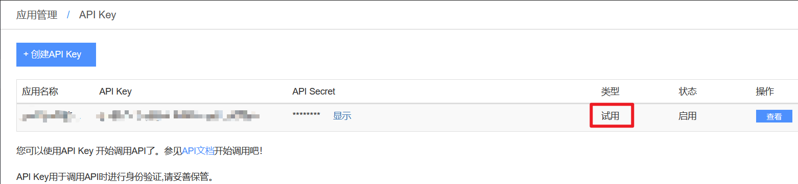
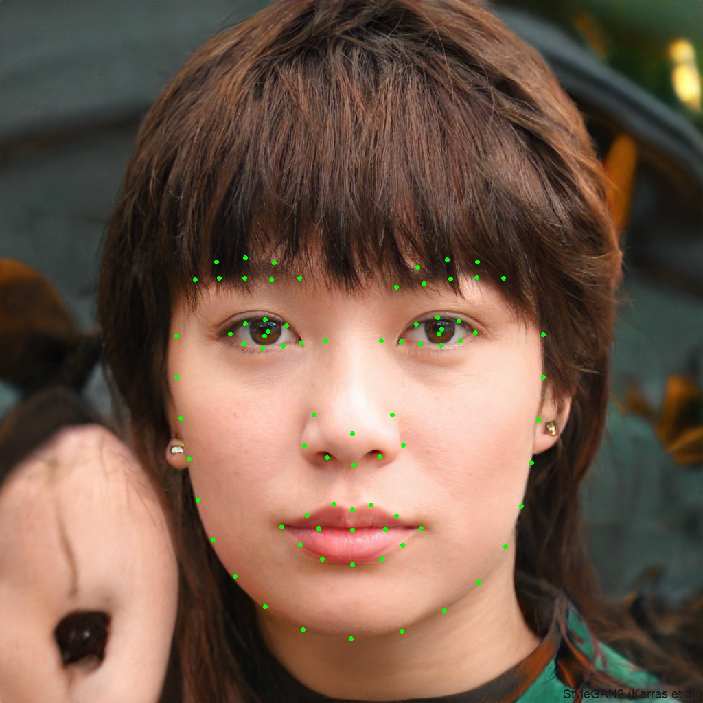

# 20240316日志

##  目录
<!-- vscode-markdown-toc -->

1.[使用face++ API 标记人脸关键点](#face) 

<!-- vscode-markdown-toc-config
	numbering=true
	autoSave=true
	/vscode-markdown-toc-config -->
<!-- /vscode-markdown-toc -->

##  1.使用face++ API 标记人脸关键点 

1.注册账号并创建API key：<https://console.faceplusplus.com.cn/documents/5671787>

这里创建的是试用API key

2.人脸检测API的使用页面：<https://console.faceplusplus.com.cn/documents/4888373>

> 需要注意： 
> 1.调用url：<https://api-cn.faceplusplus.com/facepp/v3/detect> 
> 2.调用方法；POST 
> 3.请求体格式：multipart/form-data（不太明白这个请求体格式） 

3.使用的请求参数
> 1.api_key 
> 2.api_secret  
> 3.image_file  
> 4.return_landmark 

4.构造请求头(使用python语言)

在浏览器的开发人员选项中复制相关项并写成对应的字典

    headers = {
            "User-Agent": "Mozilla/5.0 (Windows NT 10.0; Win64; x64) AppleWebKit/537.36 (KHTML, like Gecko) Chrome/122.0.0.0 Safari/537.36 Edg/122.0.0.0",
            "Accept": "text/html,application/xhtml+xml,application/xml;q=0.9,image/avif,image/webp,image/apng,*/*;q=0.8,application/signed-exchange;v=b3;q=0.7",
            "Accept-Encoding": "gzip, deflate, br, zsdch",
            "Accept-Language": "zh-CN,zh;q=0.9,en;q=0.8,en-GB;q=0.7,en-US;q=0.6",
            "Connection": "keep-alive"
        }

5.构造data

将对应的api_key,api_secret和return_landmark填入

    data = {
            "api_key": "xxxxxxxxxxxxxxxx",
            "api_secret": "xxxxxxx",
            "return_landmark": 1  # 或者填2
        }

6.上传的文件

将文件地址填入

    files = {
            "image_file": open("xx/xxx/xxx.jpg", "rb")
        }

7.处理请求的数据

> 获取landmark字段的值 
> 将每对x,y值写入元组，将所有(x,y)存入列表 
> 读取列表中的元组并在图中画点

8.测试
 
在[This Person Does Not Exist](https://www.thispersondoesnotexist.com/)中下载图片

测试结果如下：

106个人脸关键点

 

86个人脸关键点

9.所有代码

    import requests
    import cv2 as cv

    def getresponse(api_key, api_secret, return_landmark, img_path):
        # 构造请求头 请求体
        url = "https://api-cn.faceplusplus.com/facepp/v3/detect"
        headers = {
            "User-Agent": "Mozilla/5.0 (Windows NT 10.0; Win64; x64) AppleWebKit/537.36 (KHTML, like Gecko) Chrome/122.0.0.0 Safari/537.36 Edg/122.0.0.0",
            "Accept": "text/html,application/xhtml+xml,application/xml;q=0.9,image/avif,image/webp,image/apng,*/*;q=0.8,application/signed-exchange;v=b3;q=0.7",
            "Accept-Encoding": "gzip, deflate, br, zsdch",
            "Accept-Language": "zh-CN,zh;q=0.9,en;q=0.8,en-GB;q=0.7,en-US;q=0.6",
            "Connection": "keep-alive"
        }
        data = {
            "api_key": api_key,
            "api_secret": api_secret,
            "return_landmark": return_landmark
        }
        files = {
            "image_file": open(img_path, "rb")
        }
        response = requests.post(url=url, headers=headers, data=data, files=files)
        print(response.text)  # <class 'str'>
        return response.json()  # <class 'dict'>

    def getpoints(res):
        # 获取landmark 点标记 坐标数据
        face0 = res["faces"][0]
        landmark = face0["landmark"]
        # print(landmark)
        points = []
        for value in landmark.values():
            # {'x': 637, 'y': 680}
            points.append((value['x'], value['y']))
        # print(points)
        return points

    def main():
        api_key = "xxxxxxxxxxxxxxxxxxxx"
        api_secret = "xxxxxxxxxxxxxxxxxx"
        return_landmark = 2  # 1 (返回 83 个人脸关键点) 2 (返回 106 个人脸关键点)
        img_path = "C:/Users/garlic/Downloads/"
        img_name = "test2.jpg"
        img = cv.imread(img_path + img_name, cv.IMREAD_COLOR)
        res = getresponse(api_key, api_secret, return_landmark, img_path+img_name)
        points = getpoints(res)
        # 获取坐标点 在图上对应的坐标位置画点
        for point in points:
            cv.circle(img, point, 2, (0, 255, 0), 2)
        cv.imwrite(img_path + "p_" + img_name, img)
        cv.imshow("face", img)
        cv.waitKey(0)
        cv.destroyWindow("face")

    if __name__ == "__main__":
        main()

